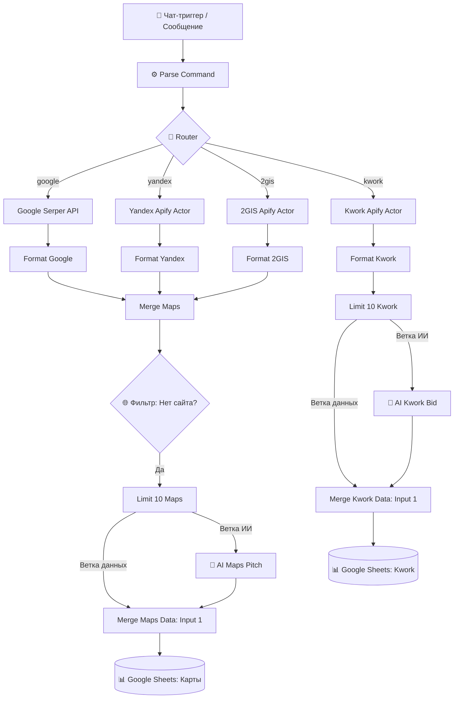

# 🚀 Omni Lead Scraper & AI Outreach Engine (n8n Workflow)

Автоматизированная система лидогенерации и холодного аутрича на базе **n8n**, **Groq AI (Qwen / LLaMA)**, **Apify**, **Google Serper** и **Google Sheets**.

Воркфлоу предназначен для **веб-студий, дизайнеров и фрилансеров**: он автоматически находит потенциальных клиентов без сайтов на картах или релевантные заказы на фриланс-бирже, генерирует персонализированные коммерческие предложения (Sales Pitch) и готовые промпты для генерации веб-дизайна, после чего сохраняет всё в Google Таблицу.

---

## 📌 Ключевые возможности

* **Мультиисточниковый парсинг (4 источника в одном сценарии):**
  * 🗺️ **Яндекс Карты** (через Apify API)
  * 📍 **2ГИС** (через Apify API)
  * 🌍 **Google Maps** (через Google Serper API)
  * 💼 **Kwork** (биржа фриланс-заказов через Apify)
* **Интеллектуальный роутер команд:** Единая точка входа через чат n8n. Бот автоматически определяет источник, тему поиска и город.
* **Умная B2B-фильтрация:** Автоматически отсекает компании, у которых уже есть сайт, оставляя только "горячих" клиентов без веб-присутствия.
* **ИИ-генерация на Groq (Qwen / LLaMA):** Сверхбыстрая генерация откликов, коммерческих питчей и промптов на дизайн лендингов / сайтов.
* **Защита от Rate Limit:** Нативная обработка лимитов API (`retryOnFail` с экспоненциальной задержкой) и оптимизация `maxTokens`.
* **Синхронное слияние данных:** Позиционное объединение (`Merge by Position`) исходных контактов компании и сгенерированных ИИ-данных.
* **Автоматический экспорт в Google Sheets:** Структурированное добавление строк на отдельные листы (`Карты` и `Kwork`) с экранированием телефонов и безопасным парсингом JSON.

---

## 🏗️ Архитектура воркфлоу

---

## 📋 Формат команд для чата

Воркфлоу запускается через узел чата (или Telegram / Webhook при подключении) текстовой командой:

| Источник | Пример команды | Что делает |
| :--- | :--- | :--- |
| **Kwork** | `кворк дизайн лендинга` | Ищет свежие проекты по веб-дизайну на бирже Kwork |
| **Яндекс Карты** | `яндекс автосервис москва` | Ищет автосервисы в Москве без сайтов |
| **2ГИС** | `2гис кофейни спб` | Ищет кофейни в Санкт-Петербурге без сайтов |
| **Google Maps** | `гугл стоматология казань` | Ищет стоматологии в Казани через Google Serper |

---

## 📊 Структура Google Таблицы

Для корректной записи создайте Google Таблицу с двумя листами:

### 1. Лист `Карты`
| Столбец | Описание |
| :--- | :--- |
| **Название** | Имя организации + кликабельная ссылка на карточку карты в скобках |
| **Категория** | Ниша / сфера деятельности компании |
| **Телефон** | Номер телефона (с префиксом `'` для сохранения текста) |
| **Адрес** | Физический адрес компании |
| **Письмо (Pitch)** | Сгенерированное ИИ персонализированное холодное письмо с предложением разработки сайта |
| **Промпт дизайна** | Подробный промпт для Midjourney / DALL-E / Figma AI на создание прототипа лендинга |

### 2. Лист `Kwork`
| Столбец | Описание |
| :--- | :--- |
| **Заказ** | Заголовок проекта на бирже |
| **Бюджет** | Бюджет заказчика (руб.) |
| **Ссылка** | Прямая ссылка на проект на бирже Kwork |
| **Текст заказа** | Полное описание задачи от заказчика |
| **Отклик от ИИ** | Профессиональный продающий отклик фрилансера на проект |
| **Промпт дизайна** | Промпт для генерации концепта сайта под этот заказ |

---

## 🚀 Установка и настройка

### Шаг 1. Импорт в n8n
1. Скачайте файл [`workflow.json`](workflow.json) (или шаблон [`workflow.template.json`](workflow.template.json)).
2. В интерфейсе **n8n** нажмите меню в правом верхнем углу `...` -> **Import from File**.
3. Загрузите JSON-файл.

### Шаг 2. Настройка учетных записей (Credentials)
Вам потребуются следующие доступы:
1. **Google Sheets OAuth2 API:**
   * Подключите ваш аккаунт Google в узлах `Sheets Maps` и `Sheets Kwork`.
   * Выберите созданную вами таблицу в поле `Document`.
2. **Groq API / OpenAI Compatible:**
   * Бесплатный ключ на [console.groq.com](https://console.groq.com).
   * В n8n подключите через узел `OpenAI Chat Model`: Base URL `https://api.groq.com/openai/v1`, модель `qwen/qwen3.8-27b` или `openai/gpt-oss-120b`.
3. **Apify API Token:**
   * Бесплатный токен на [apify.com](https://apify.com).
   * Укажите токен в параметрах URL узлов `Yandex Apify`, `2GIS Apify`, `Kwork Apify`.
4. **Google Serper API Key:**
   * Бесплатный ключ на [serper.dev](https://serper.dev).
   * Укажите в заголовке `X-API-KEY` узла `Google Serper`.

---

## 🛠️ Стек технологий

* **Оркестрация:** [n8n](https://n8n.io/) (v1.x / v2.x)
* **Парсинг:** [Apify](https://apify.com/) (`zen-studio/yandex-maps-scraper`, `dami_studio/2gis-places-scraper`, `getascraper/kwork-monitor`), [Serper.dev](https://serper.dev/)
* **ИИ & LLM:** [Groq](https://groq.com/) Cloud API (Qwen 2.5/3.8, OpenAI OSS)
* **База данных:** [Google Sheets API](https://developers.google.com/sheets/api)

---

## 📄 Лицензия
MIT License. Свободно для использования и модификации в коммерческих и личных проектах.
